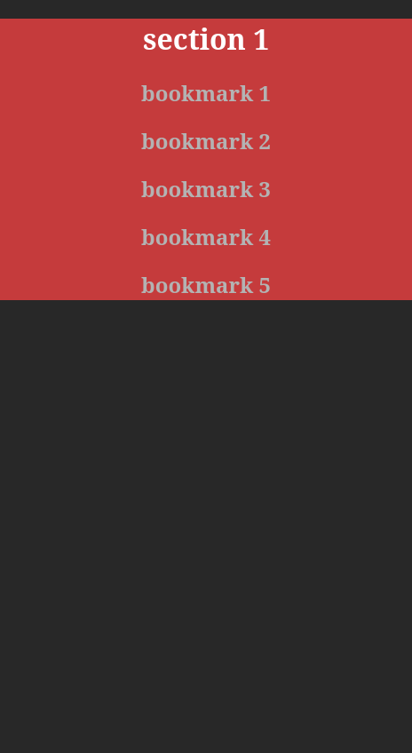

<h1 align="center">
   
  Homepage Mobile
   
</h1>

<h4 align="center">A minimal version of my homepage for mobile use.</h4>

  <a href="#key-features">Key Features</a> •
  <a href="#how-to-use">How To Use</a> •
  <a href="#related">Related</a> •
  <a href="#license">License</a>

## Key Features

* Lightweight
* One file
* Ready for mobile use

## How To Use

Since viewing HTML files in mobile browsers is difficult, I boiled down my Homepage files to one. There are a few features missing, so I might add them later.

I recommend downloading the file, changing your bookmark data on desktop and then transfering it to your mobile.

## Related

[Homepage Desktop](https://github.com/) - The desktop version of this repo

## License

MIT

---
>GitHub [@null-integer](https://github.com/null-integer)
